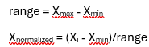
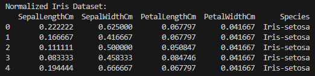
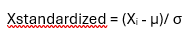
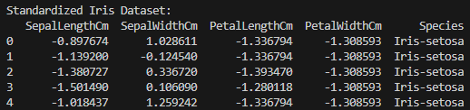

# HW4
HW 4
(Due 2/17)
Part 1 (50 points): Normalization and Standardization 
Take the iris data set and create two new .csv data sets (25 points each). One that normalizes all columns to have values between 0 and 1 and a second that standardizes all columns to have a mean of 0 and standard deviation of 1.
Push both files to github. 

Part 2 (50 points): ER Diagram 
Create an ER diagram that models a zoo:
Define at least three entities that have several attributes for each entity, their relationship between entities, and their constraints. Argue your decisions. You will graded based on your explanation on why you chose certain constraints. 
What to submit 
Either create a markdown readme file that has a copy of your ER diagram and explanation or .pdf version and push that to github.
Please also submit a link to your github submission to Canvas as well. This helps the TA grade faster.

############################### PART 1  ##################################

In the Part1, I have performed data preprocessing on the Iris dataset by applying normalizationa nd standardization techniques to the numerical features of the dataset.

1. NORMALIZATION:
    I scaled the numerical columns of the dataset to a range of 0 to 1. This is done using below formula:
        

    where Xmin and Xmax are the minimum and maximum values of each column, respectively.
    I have saved the normalized dataset as Normalized_Iris.csv.

    

2. STANDARDIZATION:
    I standardized the dataset to ensure that the numerical columns have a mean of 0 and standard deviation of 1. This is done using below formula:
        

    where μ and σ and the mean and standard deviation of each column, respectively.
    I have saved the normalized dataset as Standardized_Iris.csv.

    

############################### PART 2  ##################################
